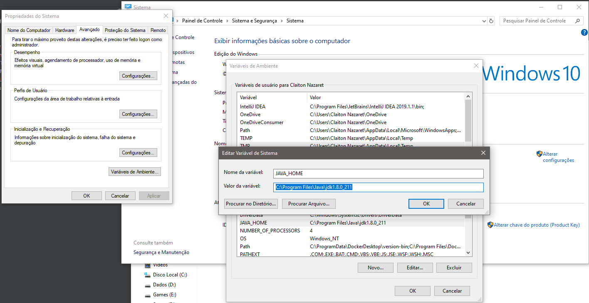
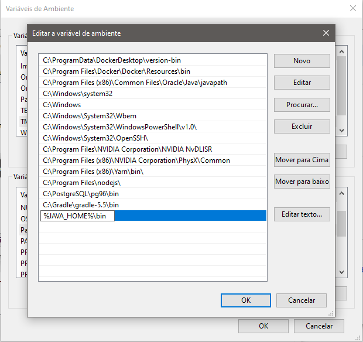

# How to run
 - ##Backend Tecnologias
  * Spring boot
  * Lombok
  * Liquibase
  * H2 Database
  * Spring Rest
  * Docker (incompleto)
  
 - #### Executar 
  - Certifique-se que possua o JDK java v.1.8.0 https://www.oracle.com/technetwork/pt/java/javase/downloads/jdk8-downloads-2133151.html)
  - Após instalar o jdk adicione as variáveis de ambiente o JAVA_HOME conforme imagem abaixo 
  - Edit a variável path adicionando %JAVA_HOME%\bin conforme imagem abaixo 
  - Na pasta server o comando `./gradlew clean bootRun` 
 
 - ##Frontend Tecnologias 
   * React App (Typescript)
   * React Router Dom
   * Ant Design (https://ant.design/)
   * ESLint
   * Formik
   
  - (Instalar o Yarn (https://yarnpkg.com/pt-BR/docs/install#windows-stable))
  - #### Executar na pasta front o comando `yarn && yarn start` 
  
## O Que foi feito

 * Crud Usuário (Listar, Salvar, Editar e Excluir)
 * Backend Java Rest (Pensei em fazer em PHP Slim Framework 3 
 mas faz algum tempo que não trabalho com Slim e demandaria mais tempo pra configurar o projeto)
 * O projeto foi dividido entre planejamento e execução das tecnologias, estruturação de bases frontend e backend
 * Validação de nome obrigatório
 * Utilizei um banco H2 in memory pois facilita na execução do teste (há um insert de dados primários somente 
 pra facilitar a primeira visualização, podendo excluir todos os dados e incluir novamente)
 
## O que não foi executado por falta de tempo hábil
 * Validação de CPF
 * Autenticação de usuário
 * O `Dockerfile` e `docker-compose` foi criado para backend mas por falta de tempo não foi criado do frontend